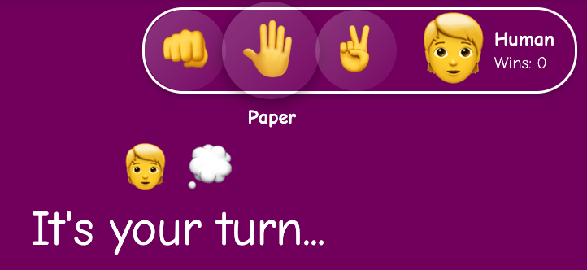

# Rock, Paper, Scissors.
## Overview
"Rock Paper Scissors" is a playable, single page web game built using HTML5, CSS3 and vanilla JavaScript.
### Project Spec
The spec for this project can be found [here](https://frontend.turing.edu/projects/module-1/rock-paper-scissors-solo.html).
 
## Learning Goals
1. Solidify and demonstrate your understanding of:
   * DRY JavaScript
   * event delegation to handle similar event listeners
2. Understand the difference between the data model and how the data is displayed on the DOM
3. Use your problem solving process to break down large problems, solve things step by step, and trust yourself to not rely on an outside “answer” to a logical challenge
## Developer note
Dear User,
My key focus for this project changed during development. What started as a project I knew I had the skill to complete without much effort, became an exploration in user UX that stretched my skill set, and patience beyond its limit.
Because I had not clarified all requirements before starting, I did not plan for the user to be able to change their playable token until mid-project. When considering how a user should be able to choose their token, as a non-binary, person of color, I was faced with the reality that I could not easily choose myself in the game, unless the ability to customize became much more complex.
The result was the user to be able to choose from 54 character combinations, set their name, and choose the application theme colors.
I cannot put into words the amount of work this took, or the attention to detail included. Although I would do things quite differently in the future, this experience was invaluable to my development as an empathetic software engineer.
Stretching past the project spec, I not only learned all about emoji combinations, but I also learned some things about accessibility; how color palettes affect the users ability to read text, or see buttons. I learned about font weights, shadows, word choice, and animation timing. Corners were cut, and plans changed several times, but I am quite proud to have focused on the user's experience.
I made this for you, and I sincerely hope you enjoy it.
 
🦊  [Eli Davidson](https://github.com/elleshadow)
 
 
 
## Deploy Link
The application has been deployed to gitHub pages, and can be accessed [here.](https://elleshadow.github.io/rock-paper-scissors/)
 
## Technologies Used
* Git
* HTML
* CSS
* JavaScript
 
## User interactions
 
Game start:
 
* When the game loads, a generic player is displayed on the default purple game theme, Classic game is selected, and the main menu is open to allow for pre-game customizations.
 

 
### Close Menu:
* The menu can be closed by clicking the X in the top right corner of the menu.
* The menu can be closed any time the X icon is displayed.
 

 
### Open Menu:
* The menu can be accessed in the top right corner by clicking the ⋮ any time the icon is displayed. *The icon is not displayed when the menu is already open, or when a battle animation is playing.*
 

### Computer player.
* Upon closing the menu for the first time, the computer's character will be chosen at random, and displayed in the bottom left corner of the application.
* Although there are several options, the difficulty for each is the same.
* Some of the possible characters are below:
 
 

 
* To change computer character, refresh the page.
### Taking a turn.
* When it's your turn, your available playable options will be displayed to the left of your character's image.
* Upon hovering over any available option, the name of the option is displayed below the option.
* Simply select one of the available options to take your turn.
* An animation of the game play will be displayed once your selection is made.
*You will be returned to the selection screen upon the conclusion of the animation.
 

 
### Customize your Character:
* Menu > Character
Use this menu to update the appearance of your character
 

 
### Change Game Type:
* Menu > Game Type
Use this menu to change the game type (classic or advanced)
 

 
### Change Theme:
* Menu > Theme
Use this menu to change the theme/color of the game.
 

 
## Organizational Resources
### Project Management
 
* [Trello Board](https://trello.com/b/oCrnZutY)
 
### Wireframes / Concept designs
Below are images and designs not used on the final version of the application.
 
* V1:

* V2:

* V3:

* Custom game select menu:

* Custom fighter icons:

* Custom battle art:

 
## Disclaimer
 
This game is a school project, for education purposes only.
 
* Advanced game rules (Rock, Paper, Scissors, Lizard, Spock) are in reference to, and based on **The Big Bang Theory** *Season 2, Episode 8 - The Lizard-Spock Expansion.*
 
* **The Big Bang Theory** is a registered trademark of Chuck Lorre Productions, and Warner Bros. Television
 
* **Spock** is a name based on a character in the **Star Trek** television series.
 
* **Star Trek** is a registered trademark of [CBS Corporation]('http://cbscorporation.com/'), who therefore also owns the rights to the names of its characters.
 
This game, and its developer are in no way affiliated with, or endorsed by Chuck Lorre Productions, Warner Bros. Television, or CBS, and the developer acknowledges that the reference to, or use of, registered trademarks cannot be used to generate revenue.
 
Names will be changed / removed, in good faith, upon request.
 
 

